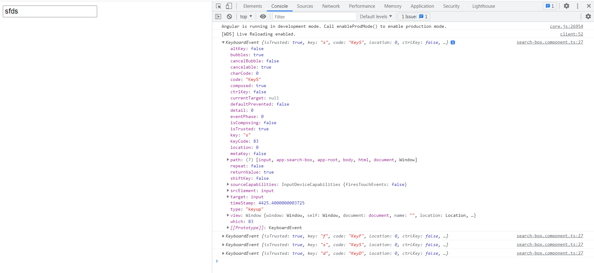

# AngularSearchBar

This project was generated with [Angular CLI](https://github.com/angular/angular-cli) version 10.2.3.

# Live URL
```
https://piyalidas10.github.io/angular-search-bar/
```


## Github API URL
```
https://api.github.com/
```

##

```
this.searchSubcription = fromEvent(this.txtField.nativeElement, 'keyup').subscribe(data => console.log(data))
```

FromEvent method to create an observable from DOM events directly, so you have to subscribe it to get data. If you directly subscribe fromEvent data, it will return keyboardEvent value.

But We want the value which we are typing in the search box, so we have to transform it into the value using pipe.

Here is the code to get value from seach box
```
this.searchSubcription = fromEvent<any>(this.txtField.nativeElement, 'keyup')
    .pipe(
      map(event => event.target.value),
    )
    .subscribe(data => console.log(data));
```


Now i have to call API to get data from backend. On each keystokes i cann't hit API, so i have to use debounceTime to control API calls.
The first very useful operator is debounceTime. In debounceTime, we have to pass time in milliseconds as a parameter. So, you will not get value emitted if it is within the specified time frame.

Here new value emits only if nothing happens for specified time frame. In our example, once the user stops writing then after 1000 milliseconds new updated value will emit.
```
this.searchSubcription = fromEvent<any>(this.txtField.nativeElement, 'keyup')
    .pipe(
      // Time in milliseconds between key events
      debounceTime(1000),
      map(event => event.target.value),      
    )
    .subscribe(data => console.log(data));
```

But here also one issue is there. If user writes “india” then pause so “india” value emits, then again start writing “indiapy” (adding “py” characters), and then immediately removes newly added characters (in our case “py”) and then pause, so again same value “india” emits. We can also prevent same value emitting again with RxJS distinctUntilChanged operator.

distinctUntilChanged() only emit when the current value is different than the last.
```
this.searchSubcription = fromEvent<any>(this.txtField.nativeElement, 'keyup')
    .pipe(
      // Time in milliseconds between key events
      debounceTime(1000),
      map(event => event.target.value),
      distinctUntilChanged()
    )
    .subscribe(data => console.log(data));
```

## Final code using switchMap

```
this.searchSubcription = fromEvent<any>(this.txtField.nativeElement, 'keyup')
    .pipe(
      // Time in milliseconds between key events
      debounceTime(1000),
      map(event => event.target.value),
      distinctUntilChanged(),
      switchMap(val => this.apiService.getUsersByLocation(val))
    )
    .subscribe(data => console.log(data));
```

Let’s examine a simple scenario:

1. a user types ‘india’ into the input,
2. switchMap operator is reached and a call to getUsersByLocation function is made with a given query string,
3. a mocked request is pending,
4. if a user change the input’s value to 'america' and the switchMap operator is reached while the previous request is still pending, the former request will be aborted and a new one will be processed. The previous subscription will be unsubscribed and the new one will be made,
5. the value emitted by the resulting observable will be in sync with the current input’s value 'america'.

## switchMap

The switchMap() operator has three important characteristics.

1. It takes a function argument that returns an observable. EmployeeSearchService.search returns an observable, as other data service methods do.
2. If a previous search request is still in-flight (as when the connection is poor), it cancels that request and sends a new one.
3. It returns service responses in their original request order, even if the server returns them out of order.

## Reference URLS
```
https://www.youtube.com/watch?v=HfVTp4yo12A
https://www.youtube.com/watch?v=ET2UPbsgPL8
https://www.freakyjolly.com/angular-rxjs-debounce-time-optimize-search-for-server-response/
https://stackoverflow.com/questions/42454740/angular-2-subscribing-to-observable-fromevent-error-invalid-event-target
https://github.com/Rinlama/AngularTools/tree/rxjsDebounceDistinctUntilChanged
https://www.freakyjolly.com/angular-rxjs-debounce-time-optimize-search-for-server-response/
https://stackblitz.com/edit/angular-debounce-search?file=src%2Fapp%2Fapp.component.ts
https://stackblitz.com/edit/angular-debounce-search-field?file=src%2Fapp%2Fapp.component.ts
```

